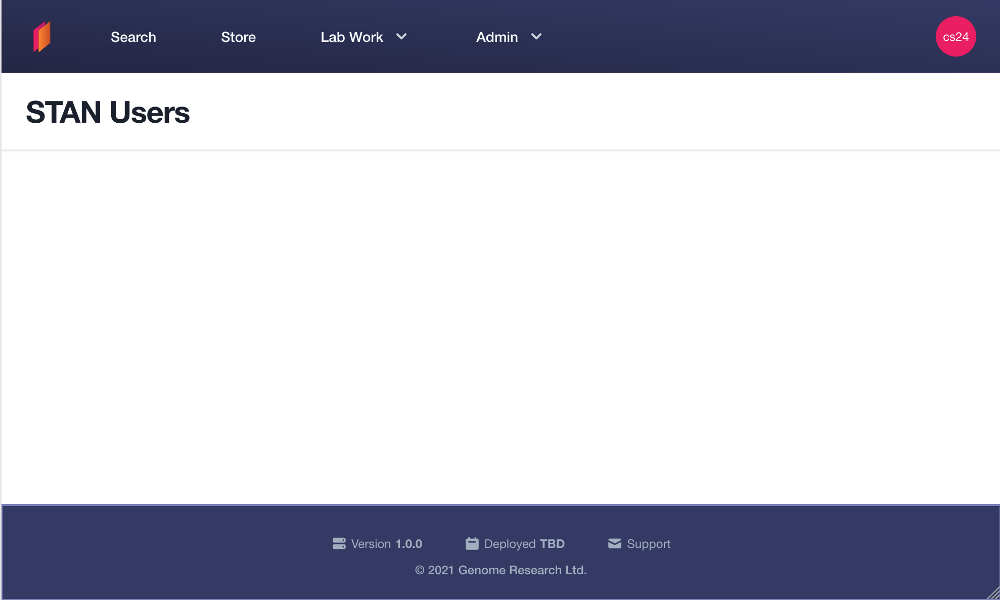

# Getting Started

## Building a new page in STAN Client

Throughout this tutorial, you will build a basic page to fetch and display a list of STAN users, as well as add new ones.

Make sure you have first gone through the `Getting Started` section of the [README](./README.md) first.

### Step 0: Start up the servers

Make sure STAN Core is up to date, and start `StanApplication` (it'll most likely start running on port `8080`).

To run the client in development mode, you can use:
```shell
yarn start
```

After a bit of time you should see a "Compiled successfully!" notification, as well as a message about how to view the client (by default it is port `3000`).

`yarn start` starts up a `node` process for watching and compiling TypeScript, as well as a process for watching and compiling the CSS with TailwindCSS.

You should now be able to navigate to [STAN Client](http://localhost:3000).

### Step 1: Adding a new "Users" page

Pages in STAN Client are located in `src/pages`. Add a new page in there named `Users.tsx`.

STAN Client is a React application, so add in a very basic React component:

```typescript jsx
import React from "react";

export default function Users() {
  return (
    <div>
      <h1>STAN Users</h1>
    </div>
  );
}
```

When you save the file, you will notice that the server will automatically detect the changes and re-build.

At the moment, there's no way to access the new page. In order to see it, we need to update the routes.

### Step 2: Add the new Users page to the Routes

Open up `src/components/Routes.tsx`. In there you will find a `<Switch>` `React` component that is used by the `react-router` library to map paths to pages.

We want to map the path `/users` to our new Users page. Inside the `<Switch>` component, add the following child:

```typescript jsx
<AuthenticatedRoute path="/users" render={(routeProps) => <Users />} />
```

(Make sure to import the `Users` component at the top of the page also i.e. `import Users from "../pages/Users";`).

This component tells react router to render the Users component whenever an **authenticated** user navigates to `/users`.

If you try it now, and you're not logged in, you will be re-directed to the login screen. Once logged in, you should be able to access the page (which at the moment is just a white screen with "STAN Users" as the title).

> Make sure you've added your username in the local STAN database to be able to log in!

### Step 3: Styling the page

All pages in STAN client use the `<AppShell>` component as a wrapper. Add it into `Users.tsx` like so:

```typescript jsx
import React from "react";
import AppShell from "../components/AppShell";

export default function Users() {
  return (
    <AppShell>
      <AppShell.Header>
        <AppShell.Title>STAN Users</AppShell.Title>
      </AppShell.Header>
      <AppShell.Main>
        <div className="mx-auto"></div>
      </AppShell.Main>
    </AppShell>
  );
}
```

As you can see, `<AppShell>` also has 3 sub-components exported: `<Header>`, `<Title>`, `<Main>`.

Once you save the file and visit the page, you will see something like the below:



### Step 4: Loading data from the API

STAN client gets its data from a GraphQL API, exposed by STAN core.

In order to fetch data about STAN users, we need to write a new GraphQL Query. Inside `./src/graphql/queries`, create a new file, `GetUsers.graphql`. Add the following the query:

```graphql
query GetUsers {
    users {
        username
        role
    }
}
```

This will call the `users` query on the API, and give the `username` and `role` for each of the users returned.

STAN client uses a generated SDK to communicate with the client. To generate the SDK with the new change, run:

```shell
yarn codegen
```

Within `src/types/sdk.ts`, new TypeScript types for the `GetUsers` query have been generated, as well as a new `GetUsers` method on the SDK.

Now, we want to call the newly generated method to fetch the user data. To do this, we use the `<DataFetcher>` component in `Routes.tsx`.

First, ammend the users page to accept a new parameter:

```typescript jsx
type UsersParams = {
  usersQuery: GetUsersQuery;
};

export default function Users({ usersQuery }: UsersParams) {
  ...
}
```

Then amend the `Routes` to add a `DataFetcher` that wraps the users page:

```typescript jsx
<AuthenticatedRoute
    path="/users"
    render={(routeProps) => (
      <DataFetcher
        key={routeProps.location.key}
        dataFetcher={stanCore.GetUsers}
      >
        {(usersQuery) => <Users usersQuery={usersQuery} />}
      </DataFetcher>
    )}
/>
```

The `<DataFetcher>` component takes care of calling the `stanCore.GetUsers` method from the SDK. It will also handle showing loading and error states, as well as letting the user try the query if it fails for any reason.

Now, if you reload `/users` with the network tab open, you should see a request is being made to core for the user information.

### Step 5: Displaying user data

Within `./src/components`, are all the components STAN client uses. Some, such as `<Button>`, are used on nearly all pages, others are more bespoke.

A `Storybook` displaying a selection of components can be found in STAN client's Github pages: [https://sanger.github.io/stan-client](https://sanger.github.io/stan-client)

We are going to display the user data in a table, for which there is a component already built. Add the following code to `<AppShell.Main>` component of the users page:

```typescript jsx
<div className="mx-auto">
  <Table>
    <TableHead>
      <TableHeader>Username</TableHeader>
      <TableHeader>Role</TableHeader>
    </TableHead>

    <TableBody>
      {usersQuery.users.map((user) => (
        <tr>
          <TableCell>{user.username}</TableCell>
          <TableCell>{user.role}</TableCell>
        </tr>
      ))}
    </TableBody>
  </Table>
</div>
```


